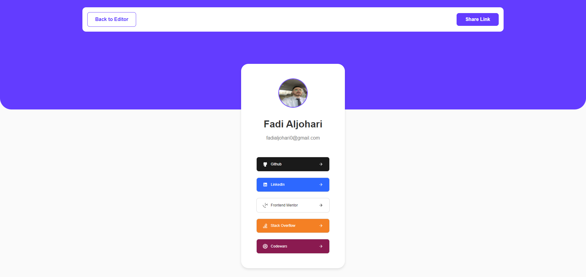

# Link Sharing

Link Sharing is a web application designed to help users create, customize, and share their collection of links on various platforms. With a user-friendly interface, users can easily manage their links, update their profile details, and generate a shareable preview page that can be added to social media bios or shared with others.

## Table of Contents

- [Overview](#overview)
- [Links](#links)
- [Features](#features)
- [Technologies Used](#technologies-used)
- [Installation](#installation)
- [Usage](#usage)
- [Screenshots](#screenshots)

## Links

- Live Site URL: [https://link-sharing-xi.vercel.app/](https://link-sharing-xi.vercel.app/)

## Overview

Link Sharing is a full responsive website that allows users to create a personalized collection of links to share across various social media platforms. Users can sign up, log in, customize their links, update their profile picture, and generate a shareable preview page. The application ensures easy management and sharing of multiple links from one central location.

## Features

- User Authentication: Sign up, log in, and log out functionality.
- Link Management: Add, edit, remove.
- Reorder links with drag and drop functionality
- Profile Customization: Update profile picture, first name, last name, and email.
- Shareable Preview: Generate a shareable link preview page.
- Toast Notifications: Real-time feedback for user actions (e.g., saving changes, errors).
- Skeletons for loading states
- Responsive Design: Optimized for both desktop and mobile devices.

## Technologies Used

- ReactJS
- Firebase (Authentication, Realtime Database, Storage)
- SCSS for styling
- React Router for navigation
- Context API for state management
- React Toastify for notifications
- react-beautiful-dnd (for drag-and-drop functionality)
- Various React hooks

## Installation

1. Clone the repository:
   ```sh
   git clone https://github.com/fadialjawhary0/link-sharing
   ```
2. Navigate to the project directory:
   ```sh
   cd coffee-roasters
   ```
3. Install the dependencies:
   ```sh
   npm install
   ```

## Usage

1. Start the development server:
   ```sh
   npm start
   ```
2. Open your browser and go to http://localhost:3000 to view the website.
3. Sign up for a new account or log in with an existing account.
4. Add, edit, remove, and reorder your profile links as needed.
5. Share your profile link to let others view your links.

## Screenshots

Sign up:


Home page / Links:


Home page / Profile:


Preview page:

